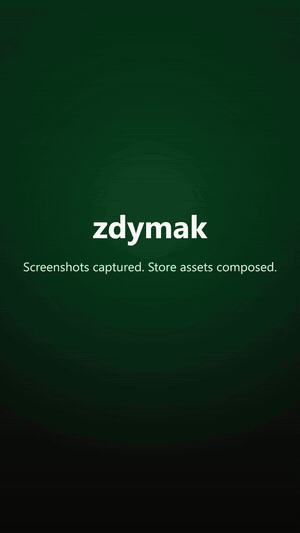
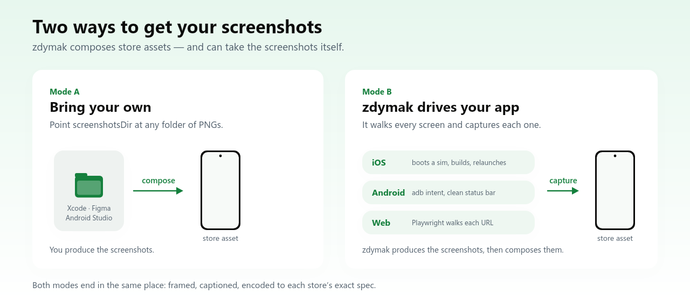

# zdymak

**Premium App Store & Google Play preview videos — from your screenshots, in one command.**

Turn a handful of app screenshots into a cinematic, **spec-compliant** store preview: spring-eased camera
moves, kinetic captions, and an encode that App Store Connect and Google Play accept without a fight. One
small config per project; the engine lives here, shared across all your apps.

<p align="center">
  <video src="https://github.com/Lonli-Lokli/zdymak/raw/main/docs/demo.mp4" width="300" controls muted loop playsinline></video>
  
</p>
<p align="center"><em>▶︎ Made by zdymak, from six real app screenshots. <code>npm run demo</code> rebuilds it
(<code>examples/promo.config.mjs</code>) — the same scene list also renders an iPhone reel and a Play promo.</em></p>

> Why it exists: a plain "Ken-Burns zoom over screenshots" reads as amateur, and hand-encoding to each
> store's exact spec (Apple: 886×1920, H.264 High@4.0, 15–30s, **no device frame**) is fiddly and easy to
> get rejected. This bakes the premium motion and the store rules in.

<br>

## What you get

| | |
|---|---|
| 🎬 **Premium motion** | Per-scene **spring dolly** (push-in / pull-back / drift) that eases and *settles* — not a flat pan. Captions sit **outside** the camera so they stay steady while the screen drifts (parallax), and rise in with a spring. |
| ✅ **Store-compliant** | Full-bleed (no bezel — Apple rejects bezels), exact resolution, H.264 High @ the right level, yuv420p, faststart. |
| 🍎 **App Store + 🤖 Play** | One 886×1920 file fills both iPhone App Preview slots; a 1080×1920 file is ready for a Play/YouTube promo. |
| 📸 **It can take the screenshots too** | Not just a compositor: it **drives your app** and captures every screen — boots an iOS sim (and can build+install), walks Android over `adb` with a clean status bar, or navigates a web app with Playwright. |
| ⚙️ **Config-driven** | Everything project-specific is one `zdymak.config.mjs`. The tool is otherwise generic. |

<br>

## Install

```sh
npm i -g zdymak      # global CLI → `zdymak <command>`
# …or per-project:
npm i -D zdymak      # → `npx zdymak <command>`
```

Also needs **Node ≥18** and **ffmpeg** on your `PATH`:

| Platform | Install ffmpeg |
|---|---|
| **macOS** | `brew install ffmpeg` |
| **Linux** — Debian/Ubuntu | `sudo apt install ffmpeg` |
| **Linux** — Fedora | `sudo dnf install ffmpeg` |
| **Windows** | `winget install Gyan.FFmpeg`  ·  or `choco install ffmpeg` / `scoop install ffmpeg` |

zdymak finds ffmpeg on `PATH`, or set `$FFMPEG` to an explicit binary. Video generation is pure Node +
ffmpeg — no platform SDKs. Screenshot **capture** additionally needs that platform's toolchain: **Xcode**
for `--platform ios`, the **Android SDK / `adb`** for `--platform android`.

<br>

## Quickstart

**1. Add a config** to your project root (copy `examples/example.config.mjs` → `zdymak.config.mjs`):

```js
export default {
  brand: { ink: '#0b0b0a', title: '#F5F5F4', sub: '#9ae6b4' },
  screenshotsDir: './screenshots',       // where your PNGs live
  suffix: '',                             // scene id "welcome" → screenshots/welcome.png
  scenes: [
    { id: 'welcome',  title: 'Your hook.',        sub: 'The promise, briefly.', move: 'pushInSlow' },
    { id: 'feature-1', title: 'What it does.',     sub: 'Why it matters.',       move: 'driftUp' },
    { id: 'offer',    title: 'The honest offer.',  sub: 'Price / trial, plainly.', move: 'pullBackSlow' },
  ],
  targets: ['appstore-preview', 'play-promo'],
  out: './store-assets',
};
```

**2. Build:**

```sh
zdymak video
# → store-assets/appstore-preview.mp4   (886×1920, upload to App Store Connect)
# → store-assets/play-promo.mp4         (1080×1920, upload to YouTube, link in Play Console)
```

That's it. `zdymak specs` prints every target and its exact dimensions.

<br>

## Getting the screenshots — bring your own, or let zdymak drive the app

<p align="center">
  
</p>

**Mode A — bring your own.** Point `screenshotsDir` at any folder of PNGs: Xcode, an XCUITest capture,
Android Studio, Figma, anywhere.

**Mode B — zdymak drives your app and captures it.** This is the part people miss: it isn't only a
compositor. Give it a way to reach each screen and it will boot the device, walk the app through every
screen in order, and write a store-ready PNG per screen (alpha stripped — stores reject transparency).

```sh
# iOS — boots a simulator, optionally BUILDS + installs, then relaunches the app once per screen
zdymak capture --platform ios --bundle com.x.app --arg -marketingScreen   --states welcome,today,study,answer --suffix -light   --build --project App.xcodeproj --scheme App --out ./screenshots

# Android — same idea over adb, driving an intent extra
zdymak capture --platform android --component com.x.app/.MainActivity --arg marketingScreen   --states welcome,today,study,answer --out ./screenshots

# Web — no handle needed at all; the URL IS the handle
zdymak capture --platform web --url http://localhost:3000 --states /,/today,/study --out ./screenshots
```

| Platform | How it drives | What your app must provide | Needs |
|---|---|---|---|
| **iOS** | Boots/creates a simulator, optionally `xcodebuild`s and installs, then relaunches with `<arg> <state>` per screen and screenshots via `simctl`. Pins the status bar to 9:41, full bars, charging. | A launch-arg "handle" that routes to a seeded screen (e.g. reads `-marketingScreen <id>`) | Xcode |
| **Android** | `am start -n <component> --es <arg> <state>` per screen, then `adb exec-out screencap`. Turns on **SystemUI demo mode** first, so the status bar is clean (9:41, full battery/wifi, no notifications) and restores it after. | An intent extra that routes to a seeded screen | Android SDK / `adb` |
| **Web** | Playwright navigates each path itself, disables animations, waits for `document.fonts.ready` and undecoded images. Device descriptors, dark mode, locale, full-page. | Nothing — just a URL | `npm i -D playwright` |

There's also a single-shot mode (`--name welcome`) that snaps whatever is currently on screen, and
`--record` for a screen recording you can feed to the live-footage `reel`.

**It cleans up after itself.** Capture is setup *and* teardown: on iOS the status-bar override is cleared,
a simulator this run booted is shut down, and a throwaway device it created is deleted — all in a
`finally`, so a failed build can't strand a booted sim (~1.7 GB resident) with a faked status bar. A
simulator you already had running is left exactly as it was. On Android, SystemUI demo mode is switched
back off. Pass **`--keep`** to skip teardown when you want to poke at the device afterwards.

It does **not** build your app for Android or web — that's your toolchain; on iOS `--build` will do it.
And a note on macOS: there is deliberately no `--platform macos` capture, because reading a specific
native window's pixels needs a TCC grant (Screen Recording or Accessibility) and can't be a clean
one-command capture. Drive a Mac app from your own XCUITest and let zdymak compose the result.

**Web (Playwright).** A web app's "handle" is just its URL, so `--states` takes paths and the tool drives
itself:

```sh
zdymak capture --platform web --url http://localhost:3000   --states /,/today,/study --suffix -light --out ./screenshots

zdymak capture --platform web --url http://localhost:3000 --states /   --theme dark --device "iPhone 15 Pro" --suffix -mobile --out ./screenshots
```

| Flag | Meaning |
|---|---|
| `--url` | Base URL. A state may also be an absolute URL. |
| `--states` | Comma-separated paths. `/` → `home.png`, `/today` → `today.png`, `/today.html` → `today.png`. |
| `--viewport` / `--dsf` | Desktop size (default `1280x800`) and device scale factor (default `2`, retina-sharp). |
| `--device` | A Playwright device descriptor (`"iPhone 15 Pro"`, `"Pixel 7"`, `"iPad Pro 11"`) — brings its own viewport, DPR and UA. Overrides `--viewport`. |
| `--theme` | `light` (default) or `dark` → `prefers-color-scheme`. |
| `--locale` | e.g. `de-DE`, for localized capture sets. |
| `--wait` | CSS selector to wait for before shooting. |
| `--full-page` | Whole scrollable page instead of the viewport. |
| `--settle` | Extra seconds after load (default `1`). |

Playwright is an **optional dependency** — it downloads a browser, which nobody capturing only mobile
should pay for. Install it where you need it: `npm i -D playwright && npx playwright install chromium`.

Shots are made **reproducible**, so a re-run differs only where the UI did: CSS/SMIL animations and
transitions are forced to zero duration (`prefers-reduced-motion` is only a hint apps may ignore), the
caret is hidden, and each shot waits for `document.fonts.ready` plus any undecoded images — a webfont
swapping in one frame late is the classic cause of a mystery screenshot diff.

<br>

## Config reference

| Key | Meaning |
|---|---|
| `brand.ink` / `.title` / `.sub` | Hex colours for the caption scrim + title + subtitle. |
| `brand.fontPaths` | Optional custom TTFs (else: system font — San Francisco on macOS). |
| `brand.name` / `.tagline` / `.endline` / `.endsub` / `.logo` | **Reel target only** — wordmark, cold-open tagline, end-card lines, and the icon PNG for the device-framed `social-reel` bookends. |
| `brand.reel` | **Reel target only** — optional palette overrides (`bgTop`, `bgBottom`, `glowLight`, `matteTop`, `matteBottom`, `glowDark`, `titleColor`, `subColor`, `bookendTitle`, `bookendSub`). |
| `screenshotsDir` + `suffix` | Resolve `scene.id` → `${screenshotsDir}/${id}${suffix}.png`. |
| `scenes[]` | `{ id \| image, title, sub, move }`. `image` overrides the id lookup. |
| `scenes[].move` | `pushIn` · `pushInSlow` · `pullBack` · `pullBackSlow` · `driftUp` · `driftDown` · `driftLeft` · `driftRight` · `still`. Omit to auto-vary. |
| `targets[]` | Which videos to build from the top-level scenes (`zdymak specs` lists them). |
| `sceneDur` / `xfade` | Seconds per scene / cross-dissolve. Tune total length to the store's 15–30s window. |
| `theme` | **Video** matte styling — the premium-technique block (see **Theme options** below). Brand-driven defaults. |
| `stillTheme` | **Screenshot** matte styling — same option shape as `theme`; falls back to `theme` when unset. |
| `timing` | Reel-mode timeline override `{ coldOpen, scene, endCard, xfade }` for the `social-reel` bookends. |
| `music` | Optional bed for **every** video: `{ path, offset, fadeIn, fadeOut, volume }` (silent if omitted). |
| `devices` | Per-device **screenshots + reels** (see below). Configure only the devices you ship. |
| `captions` | **Localized screenshot sets** — `{ locale: './captions/de.json' \| { sceneId: { title, sub } } }` (see below). |
| `reel` | **Live-footage reel** — composite driven video `clip`s / `images` on a clean light matte, cross-dissolves (see **Live-footage reel** below). |
| `out` | Output directory. |

### Theme options (`theme` / `stillTheme`)

Both accept the same block; every key is optional with a brand-driven default. **Screenshots assume the
premium store-shot shape by default** — `captionAnchor: 'top'`, and `fit: 'contain'` for frameless windows —
so a typical `stillTheme` only sets colours. Override any key per shot.

| Key | Default | Meaning |
|---|---|---|
| `bgTop` / `bgBottom` | brand | Matte gradient top / bottom colour. |
| `glow` / `glowAlpha` | brand.sub / `0.16` | Soft radial brand-glow colour + strength. |
| `vignette` | `0.3` | 0..1 edge darkening (use `0` on a light matte). |
| `inset` | `0.955` | Fraction of the frame the screen fills (lower floats it with a wider matte border). |
| `label` | `true` | Show the caption on a pill; `false` = plain text, no pill. |
| `labelColor` / `subColor` | brand.title / brand.sub | Caption title + subtitle colour. |
| `handle` | — | Optional persistent top handle text (e.g. `@yourapp`). |
| `captionAnchor` | `bottom` (video) · `top` (stills) | Caption above (`top`) or below (`bottom`) the device. |
| `fit` | `cover` · `contain` (frameless stills) | `cover` fills + crops; `contain` shows the **whole** capture (e.g. a Mac window) with matte margins. |
| `headlineScale` | `0.062` | Caption headline size as a fraction of the frame's short edge — bump it for bigger, bolder headlines. |
| `statusBar` | `auto` | Paint a clean status bar (time · signal · wifi · **full** battery) into the empty status-bar band a capture may carry. `auto` draws it only when such a band is detected, `true` forces it, `false` skips. |
| `statusBarTime` | `9:41` | The clock shown in that status bar. |
| `statusBarCellular` | inferred | Draw cell-signal bars. On for phones, off for tablets (Wi-Fi models) and landscape captures — a Wi-Fi-only device showing signal bars is a detail that's simply false. Google asks for battery/WiFi/cell **full**, so phones show all three. |
| `anchor` | `center` | Cover-fit anchor when the capture is taller than the slot. `top` crops from the bottom only, keeping the status bar and the screen's own heading. |
| `frame` | `phone` (reel) | Device frame around a reel screen: `'phone'` iPhone bezel, or `false` for a bare rounded screen. |
| `bleed` | `false` | Reel only: the source **fills the whole frame** (no matte / frame / shadow) — a compliant full-bleed App Store App Preview. |

<br>

## Store requirements (verified)

The numbers below are read from the stores' own pages, not from blog posts, and each row says which
zdymak target produces it. `zdymak specs` prints the same matrix from the code. **Re-verify before a
release** — store forms change, and a bounced submission is usually a dimension that moved.

Sources: Apple [Screenshot specifications](https://developer.apple.com/help/app-store-connect/reference/screenshot-specifications/)
· Apple [App preview specifications](https://developer.apple.com/help/app-store-connect/reference/app-preview-specifications/)
· Google [Add preview assets](https://support.google.com/googleplay/android-developer/answer/9866151)
*(checked July 2026)*

### App Store — screenshots

| Slot | Size | Required? | Target |
|---|---|---|---|
| iPhone 6.9" | 1320×2868 | one iPhone size required if it runs on iPhone | `appstore-iphone-6.9` |
| iPhone 6.5" | 1284×2778 *(or 1242×2688)* | only if you skip 6.9" | `appstore-iphone-6.5` |
| iPad 13" | 2064×2752 | **required** if it runs on iPad | `appstore-ipad-13` |
| Mac | 2880×1800 *(16:10; also 1280×800 · 1440×900 · 2560×1600)* | **required** for Mac apps | `appstore-mac` |
| Apple Watch | 422×514 *(or 410×502 · 416×496 · 396×484 · 368×448 · 312×390)* | **required** for Watch apps | `appstore-watch` |

**1–10 per device type · JPEG/PNG · no alpha.** Apple down-scales the largest class to smaller ones, so
6.9" + 13" covers the phone and tablet families. Pick ONE Watch size and use it in every localization.

### App Store — App Previews (video)

| Slot | Size | Target |
|---|---|---|
| iPhone (6.9" / 6.5" / 6.3" / 6.1") | 886×1920 portrait | `appstore-preview` |
| iPad (13" / 12.9" / 11" / 10.5") | 1200×1600 portrait | `appstore-preview-ipad` |
| Mac | 1920×1080 landscape only | `appstore-preview-mac` |

**15–30 s** (App Store Connect rejects outside it) · **≤500 MB** · **≤30 fps** · H.264 **High ≤ 4.0** at
10–12 Mbps, or ProRes 422 HQ · `.mov` / `.m4v` / `.mp4` · stereo AAC 256 kbps @ 44.1/48 kHz ·
**up to 3 previews per device family** · poster frame defaults to 0:05 · **no device frame** — Apple
rejects bezels here, which is why `social-reel` must never go in this slot.

> **The iPad trap:** the iPad *preview* is 1200×1600 — nothing like the 2064×2752 iPad *screenshot*.
> Submitting the screenshot dimensions as a preview is a routine rejection.

### Google Play — images

| Asset | Size | Required? | Target |
|---|---|---|---|
| Phone screenshots | 1080×1920 (320–3840 px per side, **max 2:1**) | 2–8; min 2 to publish | `play-phone` |
| Tablet screenshots | 2560×1440 (16:9) | recommended for large-screen | `play-tablet` |
| Wear OS screenshots | 1080×1080 (**1:1**, 384–3840) | **required** for Wear listings | `play-wear` |
| Feature graphic | **1024×500** | **required** | `play-feature-graphic` |
| App icon | 512×512, ≤1 MB | **required** | `play-icon` |

**JPEG or 24-bit PNG · no alpha** (the icon is the one exception — 32-bit with alpha). The feature
graphic is what carries the promo video: when a video is set, it plays over the graphic at the top of
the listing, so keep the centre clear.

**Styling — read this carefully, the rule differs by form factor:**

- **Wear OS** — a *requirement*: show only the app interface, no device frames, no added graphics.
- **Phone / tablet** — device frames are **recommended against** (it affects eligibility for Play's
  editorial promotion, not acceptance), taglines are allowed up to ~20% of the image, and stylized
  screenshots are permitted.

So a framed, captioned phone set is unlikely to be *rejected*, but the plain set is the safer upload and
the one that stays promotion-eligible — which is why the config below renders both. Status bars should be
tidy either way — no carrier, no notifications, battery/WiFi/signal full — which `statusBar: 'auto'` does.

### Google Play — video

Play takes a **YouTube URL**, never a file: render `play-promo` (1080×1920), upload it to YouTube, then
paste the link in Play Console → Main store listing → Preview video. Keep it **silent** unless the music
is cleared — a ContentID claim can force ads onto the video, and Play forbids ads on listing videos.

<br>

## Presets — every target, style and frame

`zdymak specs` prints this table from the code, so it can never drift from what the tool actually
produces. Sizes below were checked against Apple's *Screenshot specifications* / *App preview
specifications* and Google's *Add preview assets* pages.

### Video targets (`targets` / a device's `videos`) → `.mp4`

| Target | Size | Style | Where it goes | Notes |
|---|---|---|---|---|
| `appstore-preview` | 886×1920 | full-bleed | **App Store Connect → App Previews** | One file fills the 6.5" **and** 6.9" slots. H.264 High@4.0. Apple enforces **15–30 s** — zdymak warns outside it. **No device frame** (Apple rejects bezels here). |
| `play-promo` | 1080×1920 | full-bleed | **YouTube**, then the link in Play Console | Play takes a URL, not a file. Any length. Keep it silent unless the track is cleared — a ContentID claim can force ads on, which Play forbids on listing videos. |
| `social-reel` | 1080×1920 | device-framed | web · social · ads | Brand cold-open + end card (`brand.name/tagline/endline/endsub/logo`). Frame follows `theme.frame` (default iPhone — set `'android'` for Android captures). **Never** submit this as an App Preview. |
| `premium-reel` | 1080×1920 | premium matte | web · social · a landscape Mac reel | The Apple editing-vocabulary preset: floating screen on a brand matte, spring-then-freeze dolly, palette-aware cuts. Override `size` for landscape (e.g. `[2880, 1800]`). |

### Image targets (a device's `screenshots`) → no-alpha `.png`

| Target | Size | Store slot | Required? |
|---|---|---|---|
| `appstore-iphone-6.9` | 1320×2868 | iPhone 6.9" — Air, 17/16/15 Pro Max, 16/15 Plus, 14 Pro Max | One iPhone size required if the app runs on iPhone; Apple down-scales 6.9" to the smaller classes |
| `appstore-iphone-6.5` | 1284×2778 *(or 1242×2688)* | iPhone 6.5" — 14 Plus, 13/12/11 Pro Max, XS Max, XR | Only needed if you don't ship 6.9" |
| `appstore-ipad-13` | 2064×2752 | iPad 13" — iPad Pro M5/M4, Air M4/M3/M2 | **Required** if the app runs on iPad |
| `appstore-mac` | 2880×1800 | Mac (16:10) | **Required** for Mac apps |
| `appstore-watch` | 422×514 *(or 410×502 · 416×496 · 396×484 · 368×448 · 312×390)* | Apple Watch — Ultra 3 / Ultra 2 / Series 11 / 10 / 9…3 | **Required** for Watch apps. Pick ONE size and use it in every localization |
| `play-phone` | 1080×1920 | Play phone | 2–8 per form factor; 320–3840 px per side, max 2:1 |
| `play-tablet` | 2560×1440 | Play 7"/10" tablet + Chromebook | Recommended for large-screen visibility |
| `play-wear` | 1080×1080 | Play Wear OS (1:1) | **Required** for Wear OS listings, min 384×384 |
| `play-feature-graphic` | 1024×500 | Play feature graphic | **Required** even without a video; it's also the promo-video thumbnail, so keep the centre clear |
| `play-icon` | 512×512 | Play app icon | The only target where alpha is allowed |

Apple takes 1–10 screenshots per device type; Google takes 2–8 per form factor. Both reject transparency
everywhere except the Play icon — zdymak always writes colour-type-2 PNG, so that's handled.

### Styles (`style` on a shot — normally inferred)

| Style | What it draws | Inferred for |
|---|---|---|
| `framed` | The capture inside a device body on the matte, headline on top | Any phone/tablet/watch target |
| `premium` | The capture floating on the matte (no bezel), `fit: 'contain'` so a window shows whole | Frameless targets — Mac/desktop |
| `bleed` | The capture alone, filling the frame; caption only if the scene has one | — set it explicitly (raw Watch shots, **plain Play uploads**) |

### Frames (`theme.frame` — normally inferred from the target)

`iphone`/`phone` (Dynamic Island) · `android` (punch-hole) · `ipad`/`tablet` · `watch` (round body, crown)
· `mac` (no bezel — the capture is already a window). Inference order: *watch|wear* → `watch`, then **any
`play-*` target or *android*** → `android` (so `play-tablet` gets an Android body, not an iPad one), then
*ipad|tablet* → `ipad`, then *iphone|phone* → `phone`, else none.

> **Two compliance rules worth repeating**, because they pull in opposite directions:
> **Apple** wants an App Preview to be footage *from inside the app* with no device frame — use
> `appstore-preview` (and `examples/preview.config.mjs` for a captions-free, real-footage cut).
> **Google** requires interface-only shots for **Wear OS**, and recommends against frames elsewhere —
> see *Store-compliant Play screenshots* below. Styled output belongs on your own site and in ads.

<br>

## Screenshots & multiple devices

Videos are only half the set. `zdymak build` also renders **store screenshots** for each device you
configure, at each store's exact dimensions, as **no-alpha PNGs** (App Store & Play reject alpha). Each
device points at its own captures; scenes with no matching capture are **skipped cleanly**, so an app lists
only the devices it actually ships. **The style is inferred from the target**, so a device is usually just
its captures + target(s):

```js
devices: {
  iphone: { capturesDir: './shots/iphone', suffix: '', screenshots: [{ target: 'appstore-iphone-6.9' }] },
  ipad:   { capturesDir: './shots/ipad',   suffix: '', screenshots: [{ target: 'appstore-ipad-13' }] },
  mac:    { capturesDir: './shots/mac',     suffix: '', screenshots: [{ target: 'appstore-mac' }] },        // window on the matte
  watch:  { capturesDir: './shots/watch',   suffix: '',
            scenes: [{ id: '01-study' }, { id: '02-answer' }],   // per-device scene override (raw, no caption)
            screenshots: [{ target: 'appstore-watch', style: 'bleed', size: [422, 514] }] }, // override: raw fill
  android:{ capturesDir: './shots/android', suffix: '', screenshots: [
            { target: 'play-phone' }, { target: 'play-tablet' },
            { target: 'play-wear' },                             // 1080×1080 square, round watch body
            { target: 'play-feature-graphic' } ] },              // the 1024×500 Play banner (not per-scene)
  // a device may also carry `videos: [{ target: 'premium-reel', size: [2064, 2752] }]` at its own dimensions
},
```

**Inferred style** (override per shot with `style`): a **framed** device — iPhone (Dynamic Island), Android
(punch-hole), iPad/tablet, Watch ring — for phone/tablet/watch targets; a **premium** window-on-the-matte for
Mac/desktop (its capture is already a window, so `fit: 'contain'` shows the whole thing). Screenshots put the
**caption on top** by default. Override any of it via `stillTheme` / a per-shot `theme`, or `style: 'bleed'`
for a raw full-frame shot (Watch). **`play-feature-graphic`** is special: one 1024×500 brand banner (logo +
tagline + a tilted hero device), not a per-scene screenshot.

Commands:

```sh
zdymak build          # EVERYTHING: top-level videos + every device's screenshots (+ device videos)
zdymak screenshots    # just the per-device screenshots
zdymak video          # just the top-level video targets
zdymak reel           # LIVE-FOOTAGE montage (real motion) from the `reel` block — see below
zdymak build --clean  # wipe the output folder first, so ONLY this run's assets remain (no stale files)
```

**`--clean`** (on `build` / `screenshots` / `video` / `capture`) empties the target folder before writing,
so a removed target or renamed scene can't leave a stale screenshot behind — every file is produced by this
run. On `capture` it clears only stale PNG/MOV captures and keeps the `.dd` build cache (rebuilds stay
incremental).

`zdymak specs` lists every image target and its exact dimensions. A device that only ships iPhone simply
omits the others — that's the "use only part of it" contract.

<br>

## Store-compliant Play screenshots

Apple and Google want **opposite** things from a store screenshot, and it's worth getting right:

- **App Store** — marketing styling is expected: device frames, headlines, branded backgrounds.
- **Google Play** — the [asset guidance](https://support.google.com/googleplay/android-developer/answer/9866151)
  says the opposite: *"Do not position the screenshots within device frames, or include additional text,
  graphics, or backgrounds that are not part of the interface of the app."* For **Wear OS** it's stated as a
  requirement. Google *does* ask for a tidy status bar: *"Do not show service providers or notifications.
  The battery, WiFi, and cell service logos should be full."*

So render the Play set plain, and keep the styled one for your site and ads — `dir` lets one target do both:

```js
android: {
  capturesDir: './android/captures',
  screenshots: [
    // what you upload: app interface only, clean status bar, cropped from the bottom
    { target: 'play-phone', dir: 'play-phone-plain', style: 'bleed', caption: false, theme: { anchor: 'top' } },
    // what you put on the landing page / in ads
    { target: 'play-phone' },
    { target: 'play-feature-graphic' },
  ],
},
```

`caption: false` drops the headline; `style: 'bleed'` drops the frame and matte; `dir` keeps the two sets
from overwriting each other. The status bar comes free — see `statusBar` in the theme options above.

**Why the status bar needs drawing at all:** an Android Compose capture (`captureToImage()`) grabs the
app's window only. An edge-to-edge app still reserves the status-bar inset, so the shot has an empty band
where the clock and battery belong — the system UI is a separate window and never lands in the PNG. iOS
XCUITest captures the whole screen, so its shots already have one. zdymak detects that blank band and
paints a clean bar into it, at the capture's own density, never over app pixels.

<br>

## Localized screenshot sets

Both stores let you upload a different screenshot set per locale, and localized shots convert better than
English ones. Add a `captions` block — each locale is either a JSON file (hand it to a translator, or
generate it from the app's own i18n catalog) or an inline table:

```js
captions: {
  de: './captions/de.json',
  fr: { welcome: { title: 'Apprenez n’importe quoi.', sub: 'Retenez-le pour de bon.' } },
},
```

```json
// captions/de.json — scene id → the caption to draw
{
  "welcome": { "title": "Lerne alles.", "sub": "Und behalte es." },
  "study":   { "title": "Abrufen, kurz bevor du vergisst." },
  "$brand":  { "tagline": "Lerne alles." }
}
```

```sh
zdymak screenshots                 # base set + every configured locale
zdymak screenshots --locale de,fr  # just those two (an unconfigured locale is an error, not a no-op)
```

The base (source-language) set stays where it always was; each locale lands in `<out>/<locale>/<target>/`,
same filenames, ready to drop into that locale's store listing. Rules worth knowing:

- **A scene a locale doesn't translate keeps its base caption** — a shot with the source headline beats an
  empty slot — and every fallback is printed at the end of that locale's run, never silently.
- **`$brand`** is the one reserved key: it localizes the wordmark copy on the **feature graphic**
  (`name` / `tagline` / `endline` / `endsub`). Colours, logo and captures stay global.
- **Screenshots only.** Videos aren't re-rendered per locale — stores take localized stills far more often
  than localized previews, and each video is a multi-minute encode.

<br>

## Transitions & effects (social-ad mode)

Store previews want restraint; **social ads** legitimately want range. Both come from the same registries,
and every one is chosen **per scene** — so one config can hold a disciplined store cut and an expressive
ad cut side by side.

```js
scenes: [
  { id: 'welcome', title: 'Learn anything.' },                          // default: a hard cut
  { id: 'study', title: 'Recall it.', cut: 'flip', push: true },        // flip in, and the one camera move
  { id: 'answer', title: 'In context.', cut: 'push', effect: 'warm-film' },
  { id: 'offer', title: 'Buy once.', cut: 'dissolve' },                 // spend a dissolve on the meaning change
],
timing: { bpm: 112, beatsPerCut: 4 },                                    // cuts land on the beat
```

**`cut` names how the video gets INTO that scene.** The default is `cut` — a single frame — because a
montage that reaches for a different decorative transition at every boundary is the loudest amateur tell.
Use `auto` for a deterministic rotation that stays mostly plain, or name one yourself:

| id | duration | what it reads as |
|---|---|---|
| `cut` | 0.04s | Hard cut — instant change of subject (default) |
| `dissolve` | 0.45s | Cross-dissolve — a change of meaning, or a bookend |
| `cinematic-dissolve` | 0.70s | Dissolve with a slow breath of scale |
| `match-cut` | 0.28s | Match cut — snaps early, then holds (subjects that rhyme) |
| `fade-through-black` | 0.70s | Dip to black — a chapter break |
| `dip-to-white` | 0.60s | Dip to white — a lighter chapter break |
| `soft-flash` | 0.35s | Soft white bloom over the cut |
| `slow-zoom-through` | 0.60s | Push in through the cut |
| `pull-out` | 0.60s | Pull back through the cut |
| `soft-zoom-punch` | 0.30s | Fast scale punch — energy on the beat |
| `frame-fill` | 0.50s | The incoming frame scales up to fill |
| `push` | 0.42s | Push — navigation within the app |
| `page-slide` | 0.50s | The incoming page slides over the outgoing one |
| `warp-slide` | 0.45s | Slide with a stretch — speed you can feel |
| `whip-pan` | 0.34s | Whip pan — a blurred swing between subjects |
| `polaroid-drop` | 0.55s | The incoming frame drops in and settles |
| `clean-line-wipe` | 0.45s | Hard-edged linear wipe |
| `edge-wipe-soft` | 0.50s | Soft-edged wipe — the seam is feathered |
| `clean-circle-wipe` | 0.50s | Circular wipe from the centre |
| `iris-circle` | 0.55s | Iris — the incoming frame opens from a point |
| `iris-split` | 0.55s | Two irises open and meet |
| `mirror-split` | 0.50s | The outgoing frame splits apart down the middle |
| `heart-wipe` | 0.60s | Heart-shaped reveal |
| `flip` | 0.50s | Card flip — same object, other side |
| `spin-3d` | 0.55s | Spin — the frame swings past the camera and the next swings in |
| `page-peel` | 0.60s | The outgoing page peels away on a diagonal |
| `tearing-paper` | 0.65s | The outgoing frame tears in two and parts |
| `light-leak-wipe` | 0.60s | A warm light leak sweeps the cut |
| `glare-sweep` | 0.50s | A lens-flare streak crosses the cut |
| `floodlight-sweep` | 0.60s | A warm stage light swells across the cut |
| `clouds-wipe` | 0.70s | Soft billows part to reveal |
| `glitch-cut` | 0.36s | RGB split + scanlines — a deliberate digital break |

**`effect` is the per-scene look.** A `grade` is a CSS filter applied to the capture; an `overlay` is drawn
over the finished frame. Effects are **reel-only** and never touch store screenshots — Google requires Play
shots to show the interface unaltered, so grade your ads, not your listing.

| id | kind | look |
|---|---|---|
| `none` | — | No effect |
| `bw` | grade | Black & white |
| `sepia` | grade | Sepia |
| `cool` | grade | Cool cast |
| `vibrant` | grade | Vibrant |
| `soft-faded` | grade + overlay | Soft faded film |
| `warm-film` | grade + overlay | Warm film |
| `duotone` | grade + overlay | Duotone |
| `vignette` | overlay | Vignette — darkens the corners |
| `soft-glow` | overlay | Soft glow — light blooms out of the highlights |
| `dreamy-haze` | grade + overlay | Dreamy haze |
| `bokeh` | overlay | Bokeh — drifting out-of-focus lights |
| `glare` | overlay | Glare — a static lens streak |
| `floodlight` | overlay | Floodlight — a warm pool of stage light |
| `light-leak` | overlay | Light leak — warm bleed from the edge |
| `film-grain` | overlay | Film grain |
| `scanlines` | overlay | Scanlines — CRT texture |
| `dust-scratches` | overlay | Dust & scratches — projected-print wear |
| `falling-snow` | overlay | Falling snow |
| `sparkles-fireflies` | overlay | Sparkles / fireflies |
| `heart-drift` | overlay | Drifting hearts |
| `confetti-drift` | overlay | Drifting confetti |
| `clouds-drift` | overlay | Drifting clouds |

Adding one is a single entry in `src/transitions.mjs` / `src/effects.mjs` — `paint(ctx, prev, next, p)` and
`overlay(ctx, { W, H, t, p })` are pure functions over a canvas, so nothing in the render loop changes. The
type guard fails the build if a registered id isn't declared in `types/index.d.ts`.

Everything random is derived from a hashed index rather than `Math.random()`, so a re-render is
bit-identical — you can diff two cuts of a video and see only what you actually changed.

<br>

## Live-footage reel — real motion, not Ken Burns

The video *targets* above animate a **static screenshot** (a subtle dolly) — inherently Ken Burns. For a
genuinely premium reel, feed **real motion**: `zdymak reel` composites short **recordings** of your app (or
an image sequence) on a clean matte, floats each with a rounded frame + soft shadow, puts the headline **on
top**, and **cross-dissolves** between beats — the restrained, Apple-App-Preview language. The matte defaults
to **light** (consistent with the store screenshots) and stills get a slow, never-freezing push-in.
Source-agnostic, like the two screenshot modes: each segment's footage can be **brought by you** or
**captured** by `zdymak capture --record`.

```js
reel: {
  size: [1080, 1920], bpm: 120, beatsPerCut: 4,   // hold = beatsPerCut × 60/bpm seconds per segment
  transition: 'dissolve',                          // default; 'cut' for beat-matched hard cuts
  music: { path: './bed.mp3', volume: 0.9, fadeIn: 0.6, fadeOut: 0.8 }, // optional, faded
  // theme: { bgTop: '#0e1a12', bgBottom: '#0b0b0a', label: true },     // override to a DARK bed if you want
  segments: [
    { clip: './rec/study.mov',   caption: { title: 'Recall it.', sub: 'Right before you forget.' } },
    { images: ['a.png', 'b.png'], caption: { title: 'Many cards.', sub: 'One page.' } }, // multi-photo page
  ],
}
```

- **`clip`** = a recording (real motion). **`image`** / **`images`** = one still or a sequence shown within
  the segment (a "multiple photos per page" beat). **`transition`** = `dissolve` (default) or `cut`. The screen
  sits in an **iPhone frame** by default (`theme.frame`: `'phone'` | `false` for a bare rounded screen). Matte
  colours / `inset` / `radius` / `shadow` / caption anchor default to a clean **light** look; override via the
  reel `theme`. Run `zdymak reel` → `<out>/reel.mp4`.
- **Compliant App Store App Preview** — Apple's in-store slot wants *real footage, full-bleed, no device
  frame*. Point the reel at recordings (not stills) with `theme: { bleed: true }`, `size: [886, 1920]`,
  `level: '4.0'`, and no captions. (The framed light reel above is the marketing/social asset, not the slot.)

## Where each file goes

- **App Store** — `appstore-preview.mp4` → App Store Connect → your app → *(localization)* → **App
  Previews**. One 886×1920 file fills **both** the 6.5" and 6.9" slots. Optional at launch; screenshots
  alone are a valid submission.
- **Google Play** — Play takes a **YouTube URL**, not a file. Upload `play-promo.mp4` to YouTube, then
  paste the link in Play Console → Main store listing → **Preview video**.
- **Web / social** — `social-reel.mp4` (**device-framed**: iPhone bezel + logo bookends) or
  `premium-reel.mp4` (**premium**: matte + vignette + label pills). For your website, X / Instagram /
  TikTok, or YouTube. **Never** put either in the App Store App Preview slot — the bezel/label make them
  marketing assets, not App Previews; that's what the full-bleed `appstore-preview` is for.

> **Three styles, one config.** Every target reads the same `scenes`; the style is fixed per target:
> - **full-bleed** (`appstore-preview`, `play-promo`) — the screen fills the frame; required for App Previews.
> - **device-framed** (`social-reel`) — an iPhone bezel + brand background + logo cold-open/end-card.
> - **premium** (`premium-reel`) — the **Apple editing-vocabulary** preset: every screen floats on a brand
>   matte with a soft glow + vignette, a motion-then-freeze spring dolly, **palette-aware cuts** (hard cut
>   within a palette, dissolve only at a shift), and a bottom title **pill**. Tune it with the optional
>   `theme` block (matte colours, `vignette`, `inset`, `handle`, cut timings) — brand-driven defaults apply
>   if you omit it.

<br>

## Programmatic use

```js
import { buildVideo, loadConfig, registerFonts, videoTarget } from 'zdymak';

const cfg = await loadConfig('zdymak.config.mjs');
registerFonts(cfg.brand.fontPaths);
await buildVideo({ scenes: cfg.scenes, spec: videoTarget('appstore-preview'), brand: cfg.brand, outFile: 'out.mp4' });
```

<br>

## TypeScript

Types ship with the package (`types/index.d.ts`) — nothing to install, and **your project doesn't need
TypeScript**. Wrap the config in `defineConfig` and any modern editor type-checks and autocompletes it,
including the target ids, the `move` / `captionAnchor` unions and every theme option:

```js
// zdymak.config.mjs
import { defineConfig } from 'zdymak';

export default defineConfig({
  brand: { name: 'Asilak', tagline: 'Learn anything.' },
  scenes: [{ id: 'welcome', title: 'Learn anything.', move: 'pushInSlow' }],
  devices: { android: { screenshots: [{ target: 'play-phone' }, { target: 'play-feature-graphic' }] } },
});
```

Prefer no import? A JSDoc annotation gets you the same thing:

```js
/** @type {import('zdymak').Config} */
export default { /* … */ };
```

The programmatic API is typed too (`loadConfig` returns a `ResolvedConfig` with absolute paths). Two
guards keep the types honest: `npm run check:types` type-checks `types/types.test-d.ts` — which asserts
that bad configs are *rejected* — and fails if any config field, theme option or store target isn't
declared in the `.d.ts`. Both run on `prepublishOnly`.

<br>

## Troubleshooting

- **`ffmpeg failed to start`** — install it (`brew install ffmpeg`) or set `$FFMPEG`.
- **Captions look like a fallback font** — pass `brand.fontPaths` to your own TTF; on Linux install a
  system sans (DejaVu).
- **Duration warning** — the tool warns if a video falls outside a store's min/max; adjust `sceneDur` or
  the number of scenes.
- **`Truncating packet …` line** — harmless ffmpeg notice from the raw-frame pipe; the output is correct.

<br>

## Roadmap

- [x] Video engine — three styles (full-bleed, device-framed, premium), App Store + Play + social targets.
- [x] **Multi-device screenshots** — iPhone / iPad / Mac / Watch, no-alpha PNG, modular `devices` config.
- [x] **Device-framed stills** — inferred per target (iPhone/iPad/Android/Watch bezel, Mac window), caption
      on top, `contain`-fit windows; all overridable via `stillTheme` / per-shot `theme`.
- [x] **Music bed** — `{ path, offset, fadeIn, fadeOut, volume }` across every video.
- [x] Automated publishing — npm trusted publishing (OIDC), see `RELEASING.md`.
- [x] **TypeScript definitions** — `defineConfig` + a typed `Config`/`ResolvedConfig`, drift-guarded.
- [x] Play feature graphic (1024×500) + the `play-wear` (1:1) slot.
- [x] **Capture: Playwright (web)** driver — URL states, device descriptors, deterministic shots
      (adb / iOS-sim snapshot already shipped).
- [x] **Per-locale caption sets** — one screenshot set per store locale, reported fallbacks.

See **SKILL.md** if you drive this with Claude Code.

MIT.
